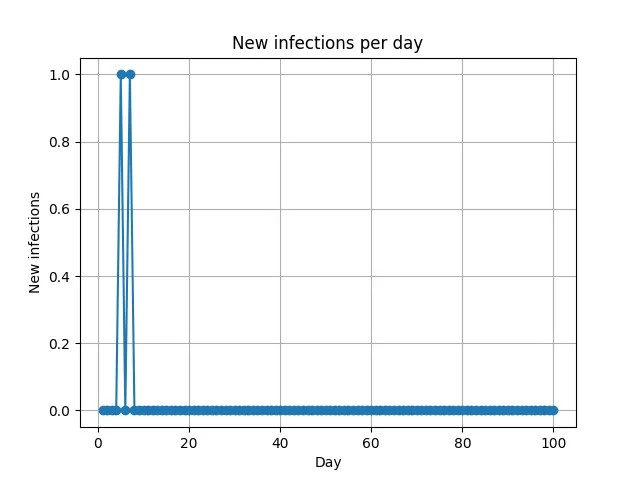
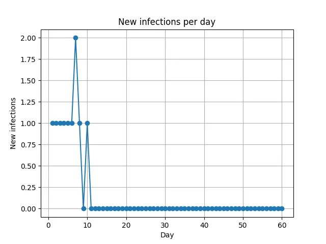
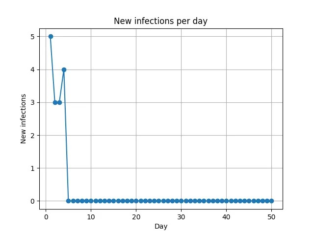

# Network Dynamic Population Model

## Overview

This project implements a **network dynamic population model** to simulate both:

1. **Cascade effects** (spread of information or behavior)
2. **Pandemic dynamics** using a **Susceptible–Infected–Recovered–Susceptible (SIRS)** model

The simulations are performed over a **directed graph** loaded from a GML file and executed through a Python command-line interface. The model also extends basic epidemic dynamics by incorporating **shelter-in-place** measures and **vaccination**.

---

## Files

* `dynamic_population.py` – Main Python script that runs the simulations
* `cascadebehaviour.gml` – Directed graph used for simulations
* `README.md` – Instructions and documentation 

---

## Requirements

* Python 3.8+
* Required libraries:

  ```bash
  pip install networkx matplotlib
  ```

---

## Running the Program

All simulations are run from the terminal using **one-line commands**.

General syntax:

```bash
python dynamic_population.py <graph_file.gml> --action [cascade|covid] [options]
```

---

## CASCADE SIMULATION

### Description

The cascade model uses a **threshold-based activation rule**:

* A node becomes active if the fraction of its active in-neighbors exceeds a specified threshold.
* The process repeats until no new activations occur.

### Example Command

```bash
python dynamic_population.py cascadebehaviour.gml --action cascade --initiator 1,2,5 --threshold 0.33 --plot
```

### Output

* A plot showing the number of active nodes per round
* Console message confirming whether a **full cascade** occurred

### Interactive Visualization

```bash
python dynamic_population.py cascadebehaviour.gml --action cascade --initiator 1 --threshold 0.25 --interactive
```

In interactive mode, the state of the graph is visualized at each round.

---

## COVID (SIRS) SIMULATION

### Description

The COVID simulation follows an **SIRS model** with the following extensions:

* Infection probability
* Death probability
* Finite simulation lifespan (days)
* Shelter-in-place percentage
* Vaccination rate

Node states:

* **S** – Susceptible
* **I** – Infected
* **R** – Recovered (temporary immunity)
* **V** – Vaccinated
* **D** – Dead

Recovered individuals eventually return to the susceptible state, modeling waning immunity.


## Results and Visualizations

This section summarizes three COVID-19 simulation scenarios that demonstrate how different parameters affect epidemic spread on the network.

All plots shown below represent **new infections per day**.

---

### 1. Controlled Outbreak (Strong Mitigation)

**Command**

```bash
python dynamic_population.py cascadebehaviour.gml --action covid --initiator 3,4 --probability_of_infection 0.02 --probability_of_death 0.01 --lifespan 100 --shelter 0.3 --vaccination 0.24 --plot
```

**Final state**

* Susceptible (S): 13
* Infected (I): 0
* Recovered (R): 0
* Vaccinated (V): 4
* Dead (D): 0

**Figure:**


**Description:**
With low infection probability and high sheltering and vaccination rates, the epidemic is quickly suppressed. The infection curve shows minimal early infections followed by zero new cases for the remainder of the simulation, representing successful outbreak control.

---

### 2. Partial Spread with Mixed Outcomes

**Command**

```bash
python dynamic_population.py cascadebehaviour.gml --action covid --initiator 3,4 --probability_of_infection 0.25 --probability_of_death 0.15 --lifespan 60 --shelter 0.15 --vaccination 0.2 --plot
```

**Final state**

* Susceptible (S): 4
* Infected (I): 0
* Recovered (R): 0
* Vaccinated (V): 3
* Dead (D): 10

**Figure:**


**Description:**
Increasing infection and death probabilities while reducing sheltering and vaccination leads to significant spread and mortality. The epidemic peaks early and naturally burns out, leaving a mix of dead, vaccinated, and susceptible individuals.

---

### 3. Worst-Case Scenario (Uncontrolled Epidemic)

**Command**

```bash
python dynamic_population.py cascadebehaviour.gml --action covid --initiator 3,4 --probability_of_infection 1.0 --probability_of_death 1.0 --lifespan 50 --shelter 0.0 --vaccination 0.0 --plot
```

**Final state**

* Susceptible (S): 0
* Infected (I): 0
* Recovered (R): 0
* Vaccinated (V): 0
* Dead (D): 17

**Figure:**


**Description:**
With no mitigation and maximized infection and death probabilities, the disease spreads to all nodes and results in total population loss. The infection curve shows a sharp early spike followed by zero new infections once the network is fully infected.

---

## Plots

* **Cascade model**: number of active nodes per round
* **COVID model**: number of new infections per day

Plots are displayed automatically when the `--plot` flag is used.

---

## Error Handling

The program includes validation for:

* Missing or invalid GML files
* Empty graphs
* Invalid probability values
* Nonexistent initiator nodes

Warnings are printed for invalid initiators without stopping the simulation.

---

## Summary

This program demonstrates how network structure and parameter choices influence:

* Cascade propagation
* Epidemic spread
* Effects of shelter-in-place and vaccination
* Containment vs worst-case outcomes

By adjusting parameters, the model reproduces realistic scenarios ranging from full suppression to total population loss.


Just tell me 👍
